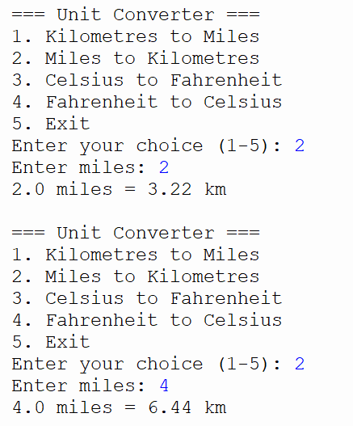
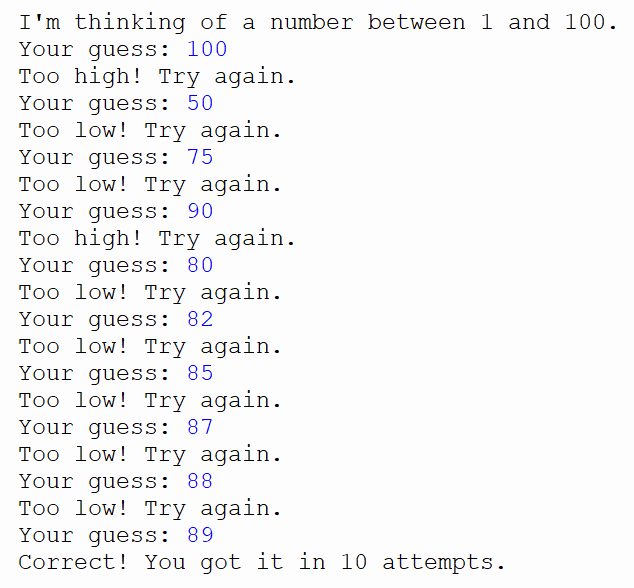
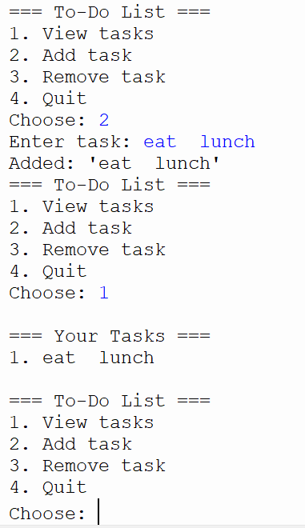

# Python programming Portfolio

**Ossie Bannister**
**Bishop's Stortford College**
**Python for STEM**
**Year 12**

---

## About me

I am a year 12 student and I have been attempting python since September 2025.I study: Business, Geography and Design and Technology and I am currently predicted B,C,A but am aspiring to achieve A* (Design and Technology) A (Business) and B (Geography). I am currently planning on studying Business management at either Loughbourogh, Exeter or Nottingham for September of 2027.

---

## Course Overview

This portfolio documents my progress through a Python programming course designed for students preparing for STEM pathways at university. The course covers:

1) Python fundamentals (variables, input/output and data types)
2) Control structures (loop and conditionals)
3) Functions and modular code
4) Data structures (lists, dictionaries, tuples and sets)
5) Validation and error handling
6) File handling
7) Object-Orientated Programming (OOP)
8) Version control with Git and GitHub
9) Working with Jupyter Notebooks

---

## Portfolio Projects

|#| Project | Key Skills | Status |
|---|---|---|---|
|1| [Unit Converter](#) | Variables, functions and input/output | ✅ Complete |
|2| [Number Guessing Game](#) | Loops, conditionals and random | ✅ Complete |
|3| [To-Do List](#) | Lists, functions and data structures | ✅ Complete |
|4| [Student Grade Calculator](#) | Dictionaries, validation and error handling | ✅ Complete |
|5| [OOP Bank Account](#) | Classes and OOP principles | ✅ Complete |
|6| [Data Analysis Notebook](#) | Jupyter Notebook and data exploration | ✅ Complete |

---

## Skills I Have Developed

**Programming Concepts**
1) Wrting clean with well-commented Python code
2) Using function to organise and reuse code
3) Handling user input safely with validation

**Tools and Technologies**
1) Python 3 (Thonny IDE)
2) Jupyter Notebooks
3) Git version control
4) GitHub for code sharing and portfolio management
5) Markdown for documentation

## Contact

**GitHub:** OssieBannister
**Email:** 26bannio@bscmail.org

# Python projects 

## Unit Converter
### What it should do:
A program that converts between common units. At minimum:

Kilometres ↔ Miles |
Celsius ↔ Fahrenheit |
Kilograms ↔ Pounds 

```python
def km_to_miles(km):
    """Convert kilometres to miles."""
    miles = km * 0.621371
    return miles

def miles_to_km(miles):
    """Convert miles to kilometres."""
    km = miles / 0.621371
    return km

def c_to_f(c):
    """Convert Celsius to Fahrenheit."""
    return (c * 9/5) + 32

def f_to_c(f):
    """Convert Fahrenheit to Celsius."""
    return (f - 32) * 5/9


def show_menu():
    print("=== Unit Converter ===")
    print("1. Kilometres to Miles")
    print("2. Miles to Kilometres")
    print("3. Celsius to Fahrenheit")
    print("4. Fahrenheit to Celsius")
    print("5. Exit")


def main():
    while True:
        show_menu()
        choice = input("Enter your choice (1-5): ")

        if choice == "1":
            km = float(input("Enter kilometres: "))
            result = km_to_miles(km)
            print(f"{km} km = {result:.2f} miles\n")

        elif choice == "2":
            miles = float(input("Enter miles: "))
            result = miles_to_km(miles)
            print(f"{miles} miles = {result:.2f} km\n")

        elif choice == "3":
            c = float(input("Enter Celsius: "))
            result = c_to_f(c)
            print(f"{c}°C = {result:.2f}°F\n")

        elif choice == "4":
            f = float(input("Enter Fahrenheit: "))
            result = f_to_c(f)
            print(f"{f}°F = {result:.2f}°C\n")

        elif choice == "5":
            print("Goodbye!")
            break

        else:
            print("Invalid choice. Please enter 1–5.\n")


main()

```

### What response does this code give?


## Number Guessing Game
### What it should do
The computer picks a random number. The player guesses until they get it right. The program tells them if their guess is too high or too low. It counts the number of guesses.

```python
import random

def play_game():
    """Play one round of the guessing game."""
    secret = random.randint(1, 100)
    attempts = 0
    
    print("I'm thinking of a number between 1 and 100.")
    
    while True:
        guess = int(input("Your guess: "))
        attempts += 1
        
        if guess < secret:
            print("Too low! Try again.")
        elif guess > secret:
            print("Too high! Try again.")
        else:
            print(f"Correct! You got it in {attempts} attempts.")
            break

play_game()

```
### What response does this code give?


## To-Do List Manager
### What it should do
A simple to-do list where the user can add tasks, view all tasks, mark a task as done, and remove tasks.

```python
def show_tasks(tasks):
    """Display all tasks with their numbers."""
    if len(tasks) == 0:
        print("No tasks yet!")
        return
    
    print("\n=== Your Tasks ===")
    for i, task in enumerate(tasks, start=1):
        print(f"{i}. {task}")
    print()

def add_task(tasks):
    """Add a new task to the list."""
    new_task = input("Enter task: ")
    tasks.append(new_task)
    print(f"Added: '{new_task}'")

def remove_task(tasks):
    """Remove a task by number."""
    show_tasks(tasks)
    number = int(input("Enter task number to remove: "))
    if 1 <= number <= len(tasks):
        removed = tasks.pop(number - 1)
        print(f"Removed: '{removed}'")
    else:
        print("Invalid number.")
def main():
    tasks = []
    
    while True:
        print("=== To-Do List ===")
        print("1. View tasks")
        print("2. Add task")
        print("3. Remove task")
        print("4. Quit")
        
        choice = input("Choose: ")
        
        if choice == "1":
            show_tasks(tasks)
        elif choice == "2":
            add_task(tasks)
        elif choice == "3":
            remove_task(tasks)
        elif choice == "4":
            print("Goodbye!")
            break

main()
```

### What response should this code give?


## Student Grade Calculator
### What it should do
The user enters a student's name and their scores for several subjects. The program calculates the average and assigns a grade (A, B, C, D, U). It handles invalid input gracefully.

```python
def get_grade(average):
    """Return a letter grade based on average percentage."""
    if average >= 70:
        return "A"
    elif average >= 60:
        return "B"
    elif average >= 50:
        return "C"
    elif average >= 40:
        return "D"
    else:
        return "U"

def get_valid_score(subject):
    """Ask for a score and keep asking until a valid number is entered."""
    while True:
        try:
            score = float(input(f"Enter score for {subject} (0-100): "))
            if 0 <= score <= 100:
                return score
            else:
                print("Score must be between 0 and 100.")
        except ValueError:
            print("Please enter a number.")

def calculate_results():
    """Collect scores and display results."""
    name = input("Student name: ")
    subjects = ["Maths", "English", "Science"]
    scores = {}
    
    for subject in subjects:
        scores[subject] = get_valid_score(subject)
    
    average = sum(scores.values()) / len(scores)
    grade = get_grade(average)
    
    print(f"\n=== Results for {name} ===")
    for subject, score in scores.items():
        print(f"  {subject}: {score:.1f}")
    print(f"Average: {average:.1f}%")
    print(f"Grade: {grade}")

calculate_results()
```

## OOP Bank Account
### What it should do
A simple bank account simulation using a class. The user can deposit money, withdraw money (with a check for sufficient funds), and check their balance.

```python
class BankAccount:
    """A simple bank account class."""
    
    def __init__(self, owner, initial_balance=0):
        """Set up the account with an owner name and starting balance."""
        self.owner = owner
        self.balance = initial_balance
        self.transactions = []
    
    def deposit(self, amount):
        """Add money to the account."""
        if amount > 0:
            self.balance += amount
            self.transactions.append(f"Deposit: +£{amount:.2f}")
            print(f"Deposited £{amount:.2f}. New balance: £{self.balance:.2f}")
        else:
            print("Deposit amount must be positive.")
    
    def withdraw(self, amount):
        """Remove money from the account if funds are available."""
        if amount <= 0:
            print("Withdrawal amount must be positive.")
        elif amount > self.balance:
            print(f"Insufficient funds. Balance is only £{self.balance:.2f}")
        else:
            self.balance -= amount
            self.transactions.append(f"Withdrawal: -£{amount:.2f}")
            print(f"Withdrew £{amount:.2f}. New balance: £{self.balance:.2f}")
    
    def show_balance(self):
        """Display the current balance."""
        print(f"\nAccount holder: {self.owner}")
        print(f"Current balance: £{self.balance:.2f}")
    
    def show_history(self):
        """Display all transactions."""
        print(f"\n=== Transaction History for {self.owner} ===")
        for t in self.transactions:
            print(f"  {t}")
        print(f"  Current balance: £{self.balance:.2f}")
def main():
    name = input("Enter account holder name: ")
    opening = float(input("Enter opening balance: £"))
    
    account = BankAccount(name, opening)
    
    while True:
        print("\n1. Deposit")
        print("2. Withdraw")
        print("3. Check balance")
        print("4. View history")
        print("5. Exit")
        
        choice = input("Choose: ")
        
        if choice == "1":
            amount = float(input("Amount to deposit: £"))
            account.deposit(amount)
        elif choice == "2":
            amount = float(input("Amount to withdraw: £"))
            account.withdraw(amount)
        elif choice == "3":
            account.show_balance()
        elif choice == "4":
            account.show_history()
        elif choice == "5":
            print("Thank you for banking with us.")
            break

main()

```
### DataBase
```python
import sqlite3

def dbConnection():
    conn = sqlite3.connect('Shoppinglist.db')
    cursor = conn.cursor()

    cursor.execute('''
        CREATE TABLE IF NOT EXISTS shopping_list (
            item_id INTEGER PRIMARY KEY AUTOINCREMENT,
            item_name TEXT NOT NULL,
            quantity INTEGER NOT NULL DEFAULT 1,
            category TEXT,
            purchased INTEGER DEFAULT 0
        )
    ''')

    return conn, cursor


def insertData():
    """Add fixed data to the database"""
    query = '''INSERT INTO shopping_list (item_name, quantity, category, purchased)
               VALUES ("shoes", 1, "foot wear", 1);'''
    conn, cursor = dbConnection()
    cursor.execute(query)
    conn.commit()
    conn.close()


def insertDataWithParameters():
    """Add user‑entered data to the database"""
    query = '''INSERT INTO shopping_list (item_name, quantity, category, purchased)
               VALUES (?, ?, ?, ?);'''

    item_name = input('Enter the item name: ')
    quantity = int(input('Enter a quantity: '))
    category = input("What category is the item? ")
    purchased = int(input('Purchased? [0 = No, 1 = Yes]: '))

    conn, cursor = dbConnection()
    cursor.execute(query, (item_name, quantity, category, purchased))
    conn.commit()
    conn.close()

    print("Record was successfully saved.")


def readDatabase():
    """Read and display all items"""
    query = "SELECT * FROM shopping_list"
    conn, cursor = dbConnection()
    cursor.execute(query)
    results = cursor.fetchall()

    print("Item Name | Quantity | Category | Purchased")
    print("-------------------------------------------")

    for row in results:
        print(row[1], row[2], row[3], row[4])

    conn.close()


def removeItem():
    print("Remove item feature not implemented yet.")


def updateItem():
    print("Update item feature not implemented yet.")


def menu():
    print("Shopping List Manager")
    print("---------------------")
    print("1. Add item")
    print("2. Show items")
    print("3. Remove item")
    print("4. Update item")
    print("5. Quit")


def main():
    while True:
        menu()
        choice = int(input("Choose an option: "))

        if choice == 1:
            insertDataWithParameters()
        elif choice == 2:
            readDatabase()
        elif choice == 3:
            removeItem()
        elif choice == 4:
            updateItem()
        elif choice == 5:
            print("----- End of Program -----")
            break
        else:
            print("Invalid option. Try again.")
```

### Contact Book with File Saving
```python
import os

FILENAME = "contacts.txt"

def load_contacts():
    """Load contacts from file. Return empty list if file doesn't exist."""
    contacts = []
    if os.path.exists(FILENAME):
        with open(FILENAME, "r") as f:
            for line in f:
                parts = line.strip().split(",")
                if len(parts) == 2:
                    contacts.append({"name": parts[0], "phone": parts[1]})
    return contacts

def save_contacts(contacts):
    """Save all contacts to file."""
    with open(FILENAME, "w") as f:
        for c in contacts:
            f.write(f"{c['name']},{c['phone']}\n")
    print("Contacts saved.")

def add_contact(contacts):
    name = input("Name: ")
    phone = input("Phone: ")
    contacts.append({"name": name, "phone": phone})
    save_contacts(contacts)

def view_contacts(contacts):
    if not contacts:
        print("No contacts saved.")
        return
    print("\n=== Contacts ===")
    for i, c in enumerate(contacts, 1):
        print(f"{i}. {c['name']} — {c['phone']}")

def main():
    contacts = load_contacts()
    print(f"Loaded {len(contacts)} contact(s).")
    
    while True:
        print("\n1. View contacts  2. Add contact  3. Exit")
        choice = input("Choose: ")
        if choice == "1":
            view_contacts(contacts)
        elif choice == "2":
            add_contact(contacts)
        elif choice == "3":
            break

main()

